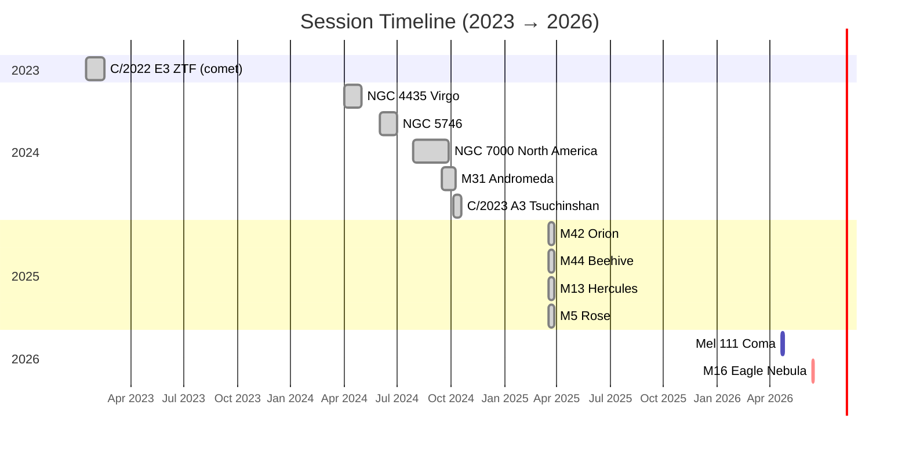

# Campaign Timeline — 2023 → 2026

Session-by-session imaging history and planned campaigns. The **Gantt** view is a hand-maintained Mermaid block (one bar per target campaign); the **log** below it is generated live from session frontmatter by Dataview.

---

## Gantt — targets across the calendar

Legend: grey = done, blue = active/imminent campaign, red = critical/planned.



> **Updating the Gantt:** when a new multi-night campaign starts, add a row to the matching `section {year}` block. Use `:done` once it's finished, `:active` during the campaign, `:crit` for planned future work. Date ranges can be explicit (`start, end`) or duration (`start, Nd`).

---

## Chronological log — live from session frontmatter

```dataviewjs
const sessions = dv.pages('"05_Sessions"')
  .where(p => p.type === "capture-session" && p.integrations && p.integrations.length > 0)
  .sort(p => p.date, "desc");

const rows = sessions.map(s => {
  const targets = [...new Set(s.integrations.map(i => String(i.target || "").trim()).filter(Boolean))].join(", ");
  const filters = [...new Set(s.integrations.map(i => String(i.filter || "").trim()).filter(Boolean))].join(", ");
  const totalMin = s.integrations.reduce((a, i) => a + (Number(i.minutes) || 0), 0);
  return [
    dv.fileLink(s.file.name),
    String(s.date),
    targets,
    filters,
    (totalMin / 60).toFixed(1) + " h",
  ];
});

dv.table(["Session", "Date", "Target(s)", "Filter(s)", "Integration"], rows);

const totalH = sessions.array().reduce(
  (a, s) => a + s.integrations.reduce((x, i) => x + (Number(i.minutes) || 0), 0),
  0
) / 60;

dv.paragraph(`**${sessions.length} capture sessions logged**, totalling **${totalH.toFixed(1)} h** of integration.`);
```

> Dead-season sessions (no `integrations:` block) are intentionally omitted — if you need the full list including blanks, widen the Dataview filter to `p.type === "capture-session"` only.

---

## Total integration (current)

| Target | Integration | Filter | Status |
|---|---|---|---|
| NGC 7000 North America | 23.2 h | L-Pro | Done |
| Mel 111 Coma | 19.97 h planned (≈ 13.2 h realistic) | L-Pro | **Active 2026-04-20 → 23** |
| M44 Beehive | 6.9 h | QB | Done |
| M42 Orion | 4.0 h | QB | Done |
| M31 Andromeda | 3.3 h | L-Pro | Done |
| M13 Hercules | 3.0 h | QB | Done |
| NGC 5746 | 2.8 h | L-Pro | Done |
| M16 Eagle | 2.25 h planned | QB | **Planned 2026-06-14 →** |
| M5 Rose | 2.0 h | QB | Done |
| NGC 4435 Virgo | 1.2 h | L-Pro | Done |
| C/2023 A3 Tsuchinshan-ATLAS | 0.4 h | L-Pro | Done |
| C/2022 E3 ZTF | 0.3 h | L-Pro | Done |

## Related

- [[Integration-Budget]] — hours-per-target bar view (live from session frontmatter)
- [[Seasonal-Calendar]] — monthly target-selection guide
- [[M16-Campaign-2026]]
- [[Cygnus-Campaign-2026]]
- [[Autumn-Broadband-Campaign-2026]]
- [[Winter-Emission-Campaign-2026]]
- [[Simeis147-Campaign-2026]]
