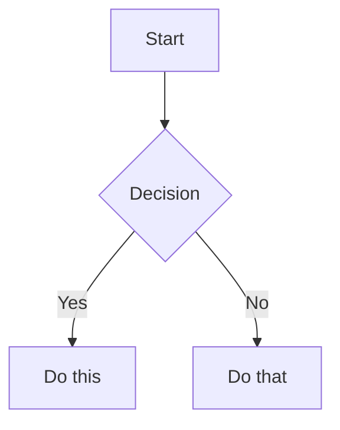
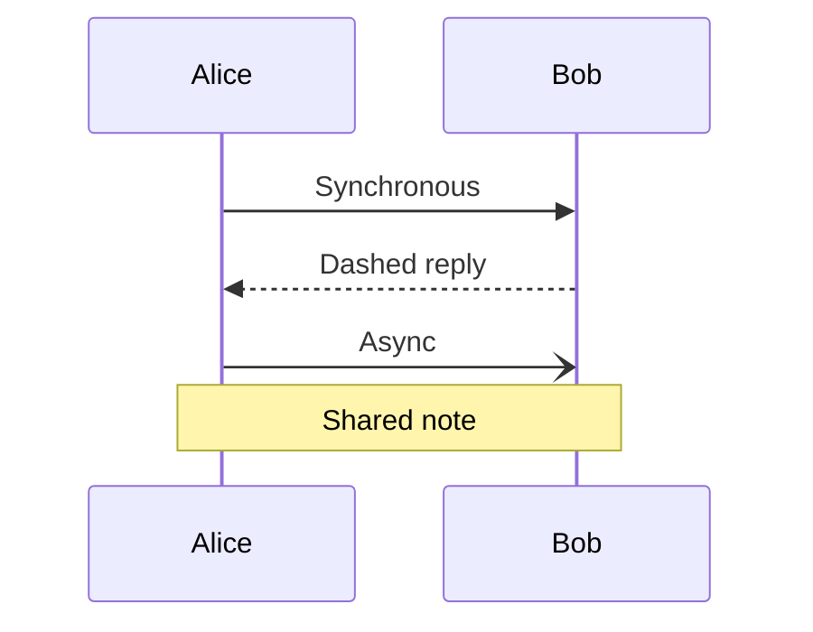
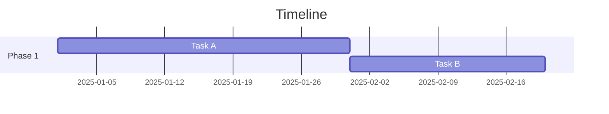
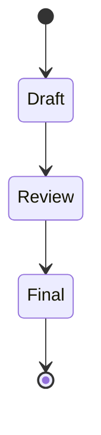
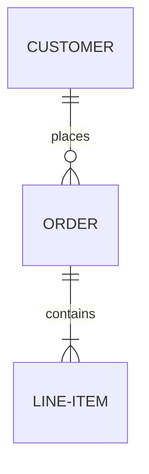
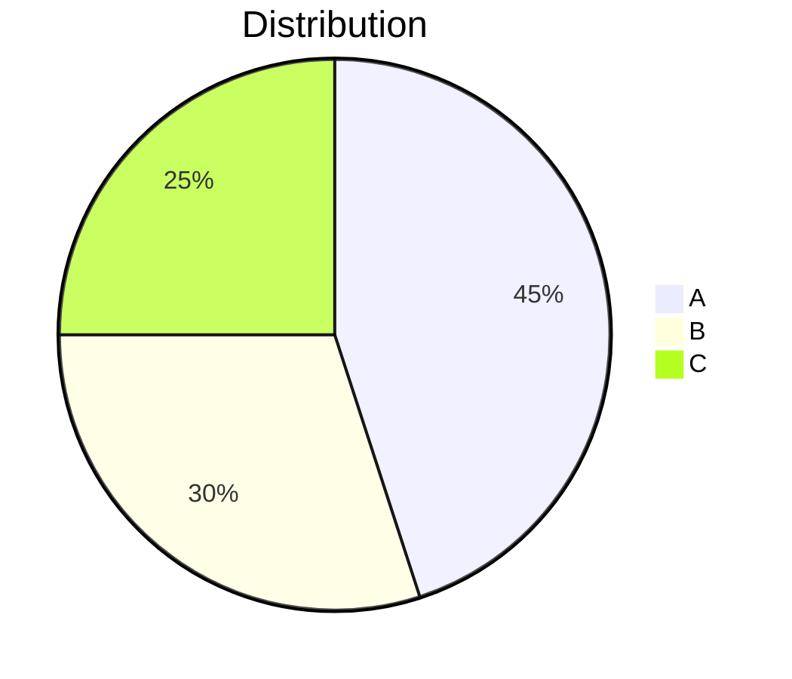

# Obsidian Markdown — Advanced Reference

Extended reference for generic Markdown syntax within Obsidian. This file is NOT auto-loaded — read it only when advanced formatting (Mermaid, LaTeX, code nesting) is needed.

## Basic Formatting

### Paragraphs and Line Breaks

Blank line between paragraphs. Two spaces at end of line for line break within paragraph.

### Text Formatting

| Style | Syntax |
|-------|--------|
| Bold | `**text**` |
| Italic | `*text*` |
| Bold + Italic | `***text***` |
| Strikethrough | `~~text~~` |
| Highlight | `==text==` |
| Inline code | `` `code` `` |

## Lists

```markdown
- Unordered item          (always use - in this vault)
  - Nested (2-space indent)
1. Ordered item
- [ ] Incomplete task
- [x] Completed task
```

## Quotes

```markdown
> Blockquote.
> > Nested quote.
```

## Code Blocks

````markdown
```language
code here
```
````

Nest code blocks using more backticks for the outer fence:

`````markdown
````markdown
```js
console.log("Hello")
```
````
`````

## Tables

```markdown
| Left     | Center   | Right    |
|:---------|:--------:|---------:|
| Left     | Center   | Right    |
```

## Math (LaTeX)

Inline: `$e^{i\pi} + 1 = 0$`

Block:
```markdown
$$
\frac{a}{b} = c
$$
```

Common: `$x^2$` superscript, `$x_i$` subscript, `$\frac{a}{b}$` fraction, `$\sqrt{x}$` root, `$\sum_{i=1}^{n}$` sum, `$\alpha, \beta$` Greek.

## Diagrams (Mermaid)

### Flowchart

````markdown

````

Direction: `TD` top-down, `LR` left-right, `BT` bottom-top, `RL` right-left.
Shapes: `[Rectangle]`, `(Rounded)`, `{Diamond}`, `([Stadium])`, `[(Database)]`, `((Circle))`.

### Sequence Diagram

````markdown

````

### Gantt Chart

````markdown

````

### State Diagram

````markdown

````

### Entity Relationship

````markdown

````

Cardinality: `||` exactly one, `o{` zero or more, `|{` one or more, `o|` zero or one.

### Pie Chart

````markdown

````

### Linking in Diagrams

Use `class A,B internal-link;` to enable clickable links to Obsidian notes.

## Footnotes

```markdown
Text with footnote[^1].
[^1]: Footnote content.
Inline footnote.^[Content here.]
```

## Horizontal Rules

```markdown
---
```

## HTML in Obsidian

```html
<details>
  <summary>Click to expand</summary>
  Hidden content.
</details>
<kbd>Ctrl</kbd> + <kbd>C</kbd>
```
